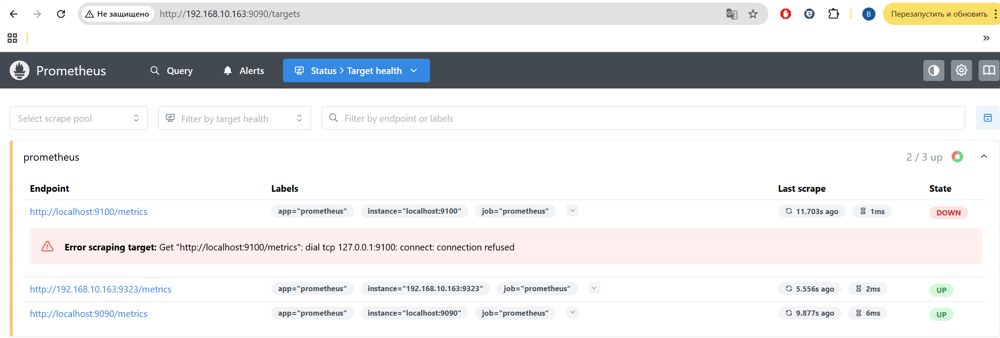
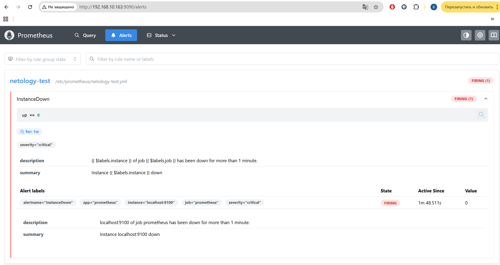

# Домашнее задание к занятию "`Домашняя работа 9-5`" - `Маховского Виктора`

---

### Задание 1

`Создайте файл с правилом оповещения, как в лекции, и добавьте его в конфиг Prometheus`
`Погасите node exporter, стоящий на мониторинге, и прикрепите скриншот раздела оповещений Prometheus, где оповещение будет в статусе Pending`
```
sudo systemctl stop node-exporter.service
```


---

### Задание 2

`Установите Alertmanager и интегрируйте его с Prometheus.`
`Прикрепите скриншот Alerts из Prometheus, где правило оповещения будет в статусе Fireing, и скриншот из Alertmanager, где будет видно действующее правило оповещения`



---

### Задание 3

`Активируйте экспортёр метрик в Docker и подключите его к Prometheus.`
`приложите скриншот браузера с открытым эндпоинтом, а также скриншот списка таргетов из интерфейса Prometheus.*`


---

